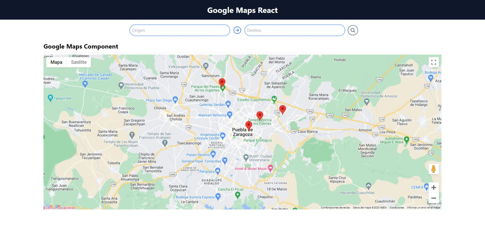
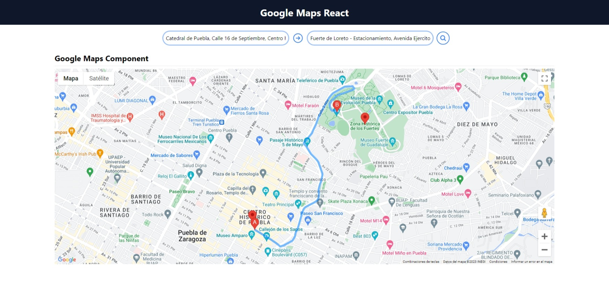

# Integracion Google Maps con React
Este proyecto es una integración de Google Maps con React, utilizando el paquete [@react-google-maps/api](https://www.npmjs.com/package/@react-google-maps/api).
Integra componentes pensado en la reulizacion que simplifican el uso de la libreria original.

## Documentación	
### Contexts
- [GoogleMapProvider y ContextGoogleMaps](./doc/contexts/ContextGoogleMaps.md)

### Componentes
- [IsLoading](./doc/components/IsLoading.md)
- [MapGoogle](./doc/components/MapGoogle.md)
- [DirectionComponent](./doc/components/DirectionComponent.md)

### Config
- [env.js](./doc/config/env.md)
- [markersDefault.js](./doc/config/markersDefault.md)


## Dependencias Utilizadas
| Nombre | Versión | Descripción |
| --- | --- | --- |
| vite | ^4.4.5 | Servidor de desarrollo rápido y compilador de construcción para aplicaciones web modernas |
| react | ^18.2.0 | Biblioteca de JavaScript para construir interfaces de usuario |
| react-dom | ^18.2.0 | Biblioteca de JavaScript para manipular el DOM en una aplicación de React |
| @react-google-maps/api | ^2.19.2 | Biblioteca de React para integrar Google Maps en una aplicación de React |
| postcss | ^8.4.31 | Procesador de CSS que transforma el CSS con JavaScript |
| tailwindcss | ^3.3.3 | Framework CSS de utilidad de baja abstracción |
| autoprefixer | ^10.4.16 | Complemento de PostCSS para agregar prefijos de proveedores a CSS |

## Instalación
- Clonar el repositorio mediante git `git clone https://github.com/CrisUTP/react-google-maps.git` o descargalo directamente del repositorio en github `https://github.com/CrisUTP/react-google-maps`

- En la raiz del proyecto crear un archivo llamado `.env` en el cual asignaras las variables de entorno para el correcto funcionamiento del proyecto, te puedes guiar del archivo `.env.example`

- Si no se configura el archivo `.env` con API_KEY el mapa no funcionara correctamente

```
VITE_API_KEY_GOOGLE_MAPS=YOUR_API_KEY_GOOGLE_MAPS
```

- Instalar las dependencias `npm install`

- Ejecutar el proyecto `npm run dev`

## Vista Previa

